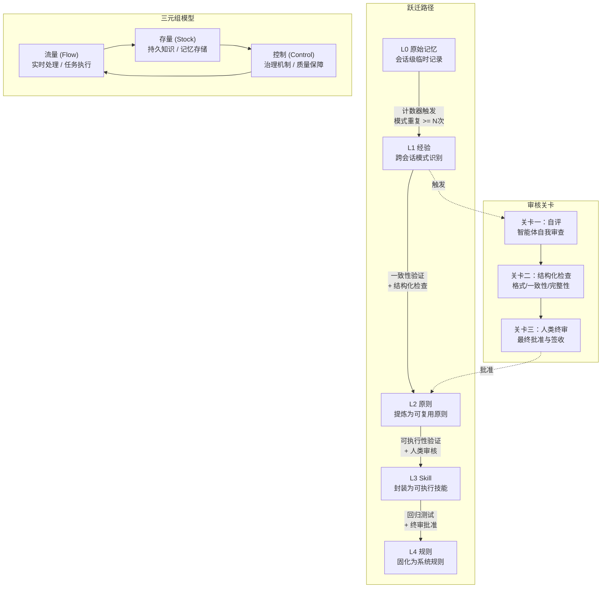
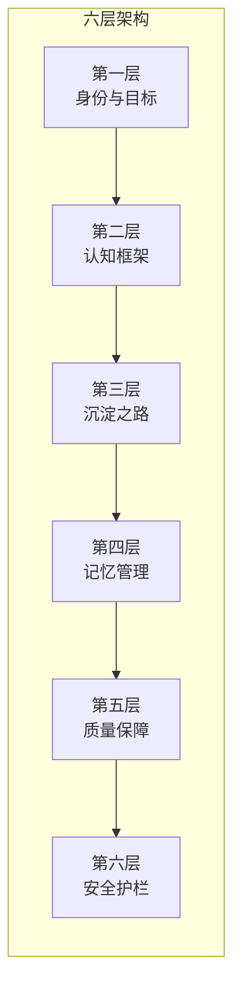

# Agent Meta-Rules（智能体元规则体系）

> 基于一般系统论的 AI 编程智能体自进化规则框架

## 项目定位

本项目构建了一套完整的 AI 编程智能体（Agent）元规则体系，以**一般系统论**为理论基础，将智能体的行为规范组织为**流量-存量-控制**三元组模型，实现规则的自进化、自动沉淀与质量保障。

## 核心特性

- **六层架构设计** —— 身份与目标 / 认知框架 / 沉淀之路 / 记忆管理 / 质量保障 / 安全护栏，层层递进，覆盖智能体全生命周期
- **四级知识跃迁路径** —— 原始记忆 (L0) -> 经验 (L1) -> 原则 (L2) -> Skill (L3) -> 规则 (L4)，知识逐层提炼、自动升级
- **流量-存量-控制三元组核心模型** —— 借鉴系统动力学，将智能体的实时处理（流量）、持久知识（存量）与治理机制（控制）统一建模
- **多关卡审核流水线** —— 自评 -> 结构化检查 -> 人类终审，三关卡确保沉淀质量
- **计数机制驱动的自动沉淀触发** —— 通过模式计数器自动识别高频行为，触发知识升级
- **安全护栏与回归保护机制** —— 防止规则退化，确保系统稳定性

## 系统架构

### 四级知识跃迁路径与三关卡审核



### 六层架构



## 目录结构

```
Agent-Meta-Rules/
├── README.md                                    # 项目说明
├── copilot-meta-rules.md                        # 元规则体系总览（根目录合并文件）
├── copilot-meta-rules/                          # 元规则核心文件目录
│   ├── META-RULES.md                            # 元规则主文件
│   ├── initialization-protocol.md               # 初始化协议
│   ├── cognitive-framework.md                   # 认知框架（全局/局部规则）
│   ├── global-local-rules.md                    # 全局与局部规则体系
│   ├── sedimentation-path.md                    # 沉淀之路（知识跃迁）
│   ├── counter-mechanism.md                     # 计数机制（自动触发）
│   ├── memory-management.md                     # 记忆管理
│   ├── quality-assurance.md                     # 质量保障（多关卡审核）
│   └── safety-guardrails.md                     # 安全护栏（回归保护）
├── 智能体系统论——AI编程体系整合理论框架.md          # 理论论文：智能体系统论
├── 元规则文件与智能体自进化——从理论到实践的桥梁.md  # 理论论文：元规则与自进化
├── -memory.instructions.md                      # 记忆系统指令文件
├── LICENSE                                      # MIT 许可证
└── .gitignore
```

## 理论文档

- [智能体系统论 —— AI 编程体系整合理论框架](智能体系统论——AI编程体系整合理论框架.md) —— 从一般系统论出发，构建 AI 编程智能体的理论体系
- [元规则文件与智能体自进化 —— 从理论到实践的桥梁](元规则文件与智能体自进化——从理论到实践的桥梁.md) —— 阐述元规则如何驱动智能体的自进化机制

## 许可证

本项目基于 [MIT License](LICENSE) 开源。
